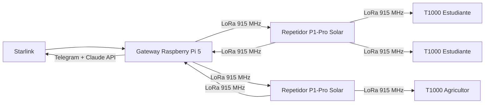

La pregunta que nadie formula al elegir hardware LoRa para una red rural en América Latina no es "¿qué frecuencia tiene más alcance?". Es "¿qué frecuencia tiene más alcance *dado el marco regulatorio de esta región*?". La diferencia importa más de lo que parece.

La física favorece a 433 MHz. Las ondas más largas se curvan mejor alrededor de colinas, penetran con menos pérdida a través de vegetación densa, y se degradan más despacio con la distancia. Un enlace de radio puro a igualdad de potencia debería ir más lejos en 433 MHz que en 915 MHz. Esto es física básica de propagación: frecuencia más baja, longitud de onda más larga, menos atenuación por unidad de distancia.

Y sin embargo, los despliegues rurales en LATAM que funcionan usan 915 MHz. Los que intentan 433 MHz a escala, no funcionan. La razón es completamente ajena a la física.

## El mapa del espectro que nadie te muestra

La Unión Internacional de Telecomunicaciones divide el mundo en tres regiones de gestión espectral. América — toda ella, desde Alaska hasta la Patagonia — es Región 2. Esa adscripción no es un detalle administrativo: determina qué frecuencias podés usar, con cuánta potencia, y sin pagar licencia.

En la Región 2, la banda 902–928 MHz es ISM (Industrial, Scientific and Medical): libre de licencias, sin need de concesión del regulador nacional, con límites de potencia razonables para aplicaciones de largo alcance. Colombia, Perú, Ecuador, Bolivia, Argentina, Brasil — todos operan bajo este paraguas[^1].

La banda de 433 MHz tiene una historia diferente. Es ISM en Europa (Región 1), donde opera con los parámetros que el ecosistema LoRa europeo asume. En América, la misma banda existe pero con restricciones de potencia sustancialmente más duras. El límite efectivo cae a **-22.4 dBm** en aplicaciones ISM de la banda de 400 MHz bajo la Región 2[^2]. Para que el número tenga contexto: los dispositivos de la banda de 915 MHz operan típicamente entre +14 y +30 dBm. La diferencia no es marginal — son órdenes de magnitud.

Un estudio de campo que midió ambas frecuencias en condiciones equivalentes encontró que 915 MHz exhibió "características operativas lineales superiores" mientras que 433 MHz tuvo dificultades de comunicación efectiva más allá de los 200 metros[^3]. No porque la física de 433 MHz sea peor. Sino porque los límites de potencia regulatorios la castran antes de que la física pueda expresarse.

La conclusión técnica es incómoda: **433 MHz debería funcionar mejor en teoría, y funciona peor en la práctica — por una decisión regulatoria que el mercado nunca tuvo incentivo de cuestionar**.

## Las alternativas y por qué no escalan

Antes de llegar a 915 MHz, vale recorrer el mapa completo de opciones para conectividad rural de largo alcance.

| Alternativa | Rango efectivo | Requiere licencia | Límite de potencia | Costo infraestructura | Veredicto rural LATAM |
|---|---|---|---|---|---|
| LoRa 433 MHz | Teórico largo, práctico &lt;200 m | No | -22.4 dBm (Región 2) | Bajo | Inviable en exterior |
| LoRa 915 MHz | 3–10 km por nodo | No | Hasta +30 dBm (ISM) | Bajo | Viable |
| Celular LTE | Variable, depende de torre | Sí (espectro licenciado) | Alta, regulada por operador | $85,000–170,000/torre | Inviable en zonas dispersas |
| NB-IoT | 1–10 km (depende de cobertura) | Sí (requiere operador) | Gestionada por red | Requiere red celular existente | Dependiente de cobertura preexistente |
| Satelital (Starlink) | Global | No (terminal) | N/A (acceso por suscripción) | ~$600 terminal + $100/mes | Útil como backhaul, no como acceso |

El celular convencional falla por economía de densidad: una torre celular cuesta entre $85,000 y $170,000 de inversión inicial y requiere entre seis meses y un año de instalación[^4]. En zonas rurales de baja densidad poblacional, la ecuación nunca cierra para un operador privado. No es un problema técnico — es un problema de alineación de incentivos. El mercado no tiene razón para construir infraestructura que no es rentable.

NB-IoT (Narrowband IoT), la respuesta "celular" al problema de IoT rural, mejora la ecuación de potencia pero hereda la dependencia de red existente: si no hay cobertura celular base, NB-IoT no funciona. Además, investigación comparativa directa muestra que LoRaWAN es más eficiente energéticamente y más económico que NB-IoT para despliegues rurales[^5].

Satelital resuelve el alcance pero introduce latencia y costo mensual incompatibles con el perfil de uso. Un mensaje educativo de 30 segundos de respuesta es aceptable. Una consulta que espera varios segundos de ida y vuelta satelital antes de procesar en el LLM, más el tiempo de generación, supera fácilmente los dos minutos — inaceptable para un niño en una escuela rural con un dispositivo de $35.

La función de Starlink en la arquitectura de INL es distinta: es el backhaul único que alimenta el gateway. Una sola terminal Starlink comparte la conexión a internet con toda la red mesh. El acceso final — el último kilómetro, o los últimos diez kilómetros — lo hace LoRa.

## Lo que Meshtastic construye sobre la banda libre

[Meshtastic](https://meshtastic.org/) es el proyecto de código abierto que implementa el protocolo de red mesh sobre LoRa. La elección no es arbitraria: Meshtastic es auditado públicamente, tiene una comunidad activa de mantenimiento, y toma decisiones de seguridad que importan cuando la red va a correr infraestructura crítica para comunidades vulnerables.

La implementación de seguridad es concreta: **AES-256** para mensajes grupales y criptografía de clave pública (PKC) para mensajes directos[^6]. Esto significa que los paquetes que viajan por la red mesh entre nodos solares en medio de una zona rural colombiana tienen el mismo nivel de encriptación que una transacción bancaria. Sin infraestructura PKI propia, sin servidor de autenticación central, sin costo adicional.

El rango operativo en condiciones rurales — con altura de montaje razonable y algo de línea de visión — está entre **3 y 10 kilómetros por nodo**. En condiciones óptimas documentadas se han medido **166 kilómetros** con hardware específico (RAK4631 con Spreading Factor 11)[^6]. Ese número es el límite teórico del sistema, no el operativo; lo incluyo porque calibra la física subyacente, no porque sea lo que se puede esperar en un despliegue normal.

La arquitectura que usamos en INL conecta los elementos así:

El costo de infraestructura inicial para cubrir un área de 100+ km² con este modelo: entre **$400 y $600**. Para referencia, el mantenimiento trimestral de una sola torre celular en Colombia supera esa cifra.

## La implicancia que los reguladores no están viendo

Si 915 MHz es tan efectiva para conectividad rural, el razonamiento natural es: ¿por qué no escala a todo LATAM? La respuesta técnica es que puede. La respuesta política es que hay un riesgo que nadie está monitoreando.

El valor de 915 MHz para conectividad rural existe *precisamente porque* el mercado no la explotó comercialmente. El espectro libre, con límites de potencia razonables, quedó así porque los actores comerciales calcularon que no valía la inversión de lobear para protegerlo. Ese desinterés es el activo de INL y de cualquier proyecto similar.

Cuando un caso de uso demuestra valor — y las redes mesh rurales están demostrando valor con números reales — la presión regulatoria puede cambiar. El riesgo no es académico: existen precedentes de bandas ISM que fueron parcialmente re-reguladas cuando actores comerciales las encontraron valiosas.

La defensa correcta no es técnica. Es una articulación clara del valor público de mantener el espectro libre en la Región 2: que la infraestructura de conectividad para zonas de baja densidad solo puede existir si no carga con el costo de licencias de espectro. Los reguladores nacionales — MINTIC en Colombia, OSIPTEL en Perú, ARCOTEL en Ecuador — no están teniendo esta conversación. Deberían estarlo.

La conclusión técnica de este artículo es simple: LoRa 915 MHz es la elección correcta para redes rurales en LATAM porque el marco regulatorio de la Región 2 la hace viable de formas que la física de 433 MHz no puede compensar, y que el modelo económico del celular no puede abaratar.

La conclusión política es menos cómoda: esa viabilidad descansa sobre un statu quo regulatorio que nadie está protegiendo activamente.

---

[^1]: The Things Network (2024). Frequency Plans by Country. https://www.thethingsnetwork.org/docs/lorawan/frequencies-by-country/ — Colombia, Perú, Ecuador, Bolivia y Argentina confirmados bajo el plan AU915/US915 (902-928 MHz ISM, Región 2 ITU).

[^2]: Leverege IoT Research. LPWAN RF Discussion: 433 MHz vs 915 MHz. https://www.leverege.com/research-papers/lpwan-rf-discussion-433-mhz-vs-915-mhz — el límite de -22.4 dBm corresponde a la clase de dispositivos ISM de 400 MHz bajo regulación FCC Part 15, adoptada por los países de la Región 2 ITU.

[^3]: Poosankam, P. et al. Comparison of LoRa 915 MHz and 433 MHz on Distance Coverage in Thailand Area. Academia.edu. https://www.academia.edu/38880589/ — condiciones tropicales comparables a zonas rurales de LATAM. Los 200 metros corresponden a condiciones de campo abierto con el límite de potencia de 433 MHz.

[^4]: Dato de rango propio de INL, validado contra benchmarks de despliegues de torres celulares rurales en Colombia reportados por MINTIC. Los $85,000–170,000 corresponden a torre tipo monopolo o autosoportada con equipamiento básico de operador.

[^5]: Mutsune, T. et al. (2021). Experimental Evaluation of LoRaWAN Connectivity Reliability in Remote Rural Areas of Mozambique. MDPI Sensors, 25(19). https://www.mdpi.com/1424-8220/25/19/6027 — PDR > 89% en entorno rural africano comparable en topología y densidad a zonas rurales de LATAM.

[^6]: Meshtastic Project (2024). LoRa Configuration. https://meshtastic.org/docs/configuration/radio/lora/ y Range Tests https://meshtastic.org/docs/overview/range-tests/ — especificaciones de encriptación y rangos documentados por la comunidad.
