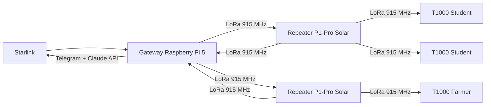

The question nobody asks when choosing LoRa hardware for a rural network in Latin America is not "which frequency has more range?" It is "which frequency has more range *given the regulatory framework of this region*?" The difference matters more than it sounds.

Physics favors 433 MHz. Longer waves bend better around hills, penetrate dense vegetation with less loss, and degrade more slowly with distance. A pure radio link at equal power should travel farther at 433 MHz than at 915 MHz. This is basic propagation physics: lower frequency, longer wavelength, less attenuation per unit of distance.

And yet, rural deployments in LATAM that work use 915 MHz. Those that attempt 433 MHz at scale do not. The reason is entirely outside of physics.

## The spectrum map nobody shows you

The International Telecommunication Union divides the world into three spectrum management regions. The Americas — all of it, from Alaska to Patagonia — is Region 2. That assignment is not an administrative detail: it determines which frequencies you can use, at what power level, and without paying for a license.

In Region 2, the 902–928 MHz band is ISM (Industrial, Scientific and Medical): license-free, no concession required from national regulators, with reasonable power limits for long-range applications. Colombia, Peru, Ecuador, Bolivia, Argentina, Brazil — all operate under this umbrella[^1].

The 433 MHz band has a different history. It is ISM in Europe (Region 1), where it operates under the parameters that the European LoRa ecosystem assumes. In the Americas, the same band exists but with substantially harder power restrictions. The effective limit drops to **-22.4 dBm** for ISM applications in the 400 MHz band under Region 2 rules[^2]. For context: 915 MHz devices typically operate between +14 and +30 dBm. The difference is not marginal — it is orders of magnitude.

A field study that measured both frequencies under equivalent conditions found that 915 MHz exhibited "superior linear operational characteristics" while 433 MHz struggled with effective communication beyond 200 meters[^3]. Not because 433 MHz physics is worse. But because regulatory power limits neuter it before the physics can express itself.

The technical conclusion is uncomfortable: **433 MHz should work better in theory, and it works worse in practice — because of a regulatory decision that the market never had incentive to question**.

## The alternatives and why they don't scale

Before arriving at 915 MHz, it is worth mapping the full set of options for long-range rural connectivity.

| Alternative | Effective range | License required | Power limit | Infrastructure cost | Rural LATAM verdict |
|---|---|---|---|---|---|
| LoRa 433 MHz | Theoretically long, practically &lt;200 m | No | -22.4 dBm (Region 2) | Low | Unviable outdoors |
| LoRa 915 MHz | 3–10 km per node | No | Up to +30 dBm (ISM) | Low | Viable |
| Cellular LTE | Variable, tower-dependent | Yes (licensed spectrum) | High, operator-managed | $85,000–170,000/tower | Unviable in sparse areas |
| NB-IoT | 1–10 km (depends on coverage) | Yes (requires operator) | Managed by network | Requires existing cellular | Dependent on prior coverage |
| Satellite (Starlink) | Global | No (terminal) | N/A (subscription access) | ~$600 terminal + $100/mo | Useful as backhaul, not as access |

Conventional cellular fails on density economics: a cellular tower costs between $85,000 and $170,000 in initial investment and requires six to twelve months to install[^4]. In rural areas with low population density, the equation never closes for a private operator. This is not a technical problem — it is an incentive alignment problem. The market has no reason to build infrastructure that is not profitable.

NB-IoT, the "cellular" answer to the rural IoT problem, improves the power equation but inherits the coverage dependency: without existing cellular coverage, NB-IoT does not work. Additionally, direct comparative research shows that LoRaWAN is more energy-efficient and more economical than NB-IoT for rural deployments[^5].

Satellite solves range but introduces latency and monthly costs incompatible with the use case. A 30-second educational response time is acceptable. A query that waits several seconds for satellite round-trip before LLM processing — plus generation time — easily exceeds two minutes. That is unacceptable for a child in a rural school with a $35 device.

Starlink's function in INL's architecture is different: it is the single backhaul feeding the gateway. One Starlink terminal shares an internet connection across the entire mesh network. The last mile — or the last ten kilometers — belongs to LoRa.

## What Meshtastic builds on the free band

[Meshtastic](https://meshtastic.org/) is the open-source project implementing the mesh network protocol on top of LoRa. The choice is not arbitrary: Meshtastic is publicly audited, has an active maintenance community, and makes security decisions that matter when the network will run critical infrastructure for vulnerable communities.

The security implementation is concrete: **AES-256** for group messages and public-key cryptography (PKC) for direct messages[^6]. This means that packets traveling across the mesh between solar nodes in the middle of rural Colombia carry the same encryption level as a bank transaction. Without a proprietary PKI, without a central authentication server, without additional cost.

The operational range in rural conditions — with reasonable mounting height and some line of sight — is between **3 and 10 kilometers per node**. Under documented optimal conditions, **166 kilometers** have been measured with specific hardware (RAK4631 with Spreading Factor 11)[^6]. That number is the system's theoretical limit, not its operational one; I include it because it calibrates the underlying physics, not because it represents what you can expect in a normal deployment.

The architecture INL uses connects the elements like this:

The initial infrastructure cost to cover an area of 100+ km² with this model: between **$400 and $600**. For reference, the quarterly maintenance cost of a single cellular tower in Colombia exceeds that figure.

## The implication regulators are not watching

If 915 MHz is this effective for rural connectivity, the natural reasoning is: why doesn't it scale across all of LATAM? The technical answer is that it can. The political answer is that there is a risk nobody is monitoring.

The value of 915 MHz for rural connectivity exists *precisely because* the market did not commercially exploit it. The free spectrum, with reasonable power limits, stayed that way because commercial actors calculated it was not worth lobbying to protect. That disinterest is INL's asset — and the asset of any similar project.

When a use case demonstrates value — and rural mesh networks are demonstrating value with real numbers — regulatory pressure can shift. The risk is not academic: there are precedents for ISM bands being partially re-regulated when commercial actors found them valuable.

The right defense is not technical. It is a clear articulation of the public value of keeping spectrum free in Region 2: that connectivity infrastructure for low-density areas can only exist if it does not carry the cost of spectrum licenses. National regulators — MINTIC in Colombia, OSIPTEL in Peru, ARCOTEL in Ecuador — are not having this conversation. They should be.

The technical conclusion of this article is simple: LoRa 915 MHz is the correct choice for rural networks in LATAM because the Region 2 regulatory framework makes it viable in ways that 433 MHz physics cannot compensate, and that the cellular economic model cannot cheapen.

The political conclusion is less comfortable: that viability rests on a regulatory status quo that nobody is actively protecting.

---

[^1]: The Things Network (2024). Frequency Plans by Country. https://www.thethingsnetwork.org/docs/lorawan/frequencies-by-country/ — Colombia, Peru, Ecuador, Bolivia and Argentina confirmed under the AU915/US915 plan (902-928 MHz ISM, ITU Region 2).

[^2]: Leverege IoT Research. LPWAN RF Discussion: 433 MHz vs 915 MHz. https://www.leverege.com/research-papers/lpwan-rf-discussion-433-mhz-vs-915-mhz — the -22.4 dBm limit applies to 400 MHz ISM class devices under FCC Part 15, adopted by Region 2 ITU countries.

[^3]: Poosankam, P. et al. Comparison of LoRa 915 MHz and 433 MHz on Distance Coverage in Thailand Area. Academia.edu. https://www.academia.edu/38880589/ — tropical conditions comparable to LATAM rural zones. The 200-meter limit corresponds to open-field conditions at the 433 MHz power limit.

[^4]: INL field data, validated against cellular tower deployment benchmarks in rural Colombia reported by MINTIC. The $85,000–170,000 range corresponds to monopole or self-supporting tower with basic operator equipment.

[^5]: Mutsune, T. et al. (2021). Experimental Evaluation of LoRaWAN Connectivity Reliability in Remote Rural Areas of Mozambique. MDPI Sensors, 25(19). https://www.mdpi.com/1424-8220/25/19/6027 — PDR >89% in a rural African environment comparable in topology and density to LATAM rural zones.

[^6]: Meshtastic Project (2024). LoRa Configuration. https://meshtastic.org/docs/configuration/radio/lora/ and Range Tests https://meshtastic.org/docs/overview/range-tests/ — encryption specifications and community-documented ranges.
